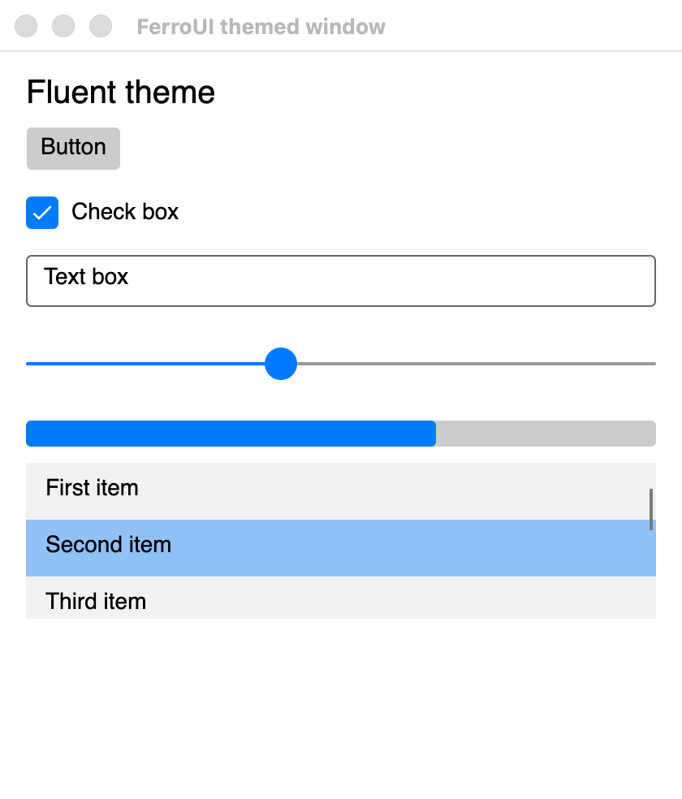

# FerroUI

[](https://github.com/wieslawsoltes/FerroUI/actions/workflows/ci.yml)
[](LICENSE)

FerroUI is a cross-platform UI framework for Rust: a retained-mode control library with a styled property system, data binding, XAML markup, control themes and a composition-based renderer. It is a port of the Avalonia UI framework to idiomatic, safe Rust that keeps the original architecture, contracts and behaviour, so that applications, themes and markup written against that model carry over with their structure intact.

> **Status: early development.** The framework builds and runs on macOS, paints themed controls and passes a large ported test suite, but the public API is not stable, several subsystems are incomplete and nothing has been published to crates.io. See [Project status](#project-status).



## Highlights

- **Complete object model.** Styled and direct properties with value priorities, inheritance, coercion and change notification; logical and visual trees; routed events; layout; input, focus and gestures.
- **Styling and theming.** Selectors, styles, control themes, resources, theme variants and transitions. The Fluent and Simple themes are included.
- **Data binding.** Compiled and reflection-style binding paths, converters, multi-bindings, data validation and templates.
- **XAML.** A port of the XamlX compiler front end together with the framework's transformers and markup extensions. Documents are loaded at run time today; ahead-of-time compilation to Rust is designed and in progress.
- **Composition renderer.** A compositor with a render loop, dirty-region tracking and server-side visuals, drawing through a backend-neutral drawing context.
- **Swappable backends.** Rendering and windowing sit behind contracts. The current backends are Skia (Graphite on Metal, Ganesh, raster) for rendering, HarfBuzz for text shaping and a native macOS windowing backend.
- **Safe Rust.** The controls, markup, XAML and theme crates contain no `unsafe` code. It is confined to a small part of the object model core and to the rendering, text shaping, platform and interop backends.

## Project status

| Area | State |
|---|---|
| Property system, trees, layout, input, styling, resources | Ported |
| Data binding, animation, transitions | Ported |
| Media, text layout, fonts | Ported |
| Compositor and render loop | Working; composition animations and custom visuals outstanding |
| Skia and HarfBuzz backends | Working |
| macOS platform | Windows, input, clipboard, drag and drop, menus, tray icon; storage dialogs and accessibility outstanding |
| Controls | Most of the control set, including items controls, text input, menus, pickers, calendar, pages and automation peers |
| XAML | Run-time loader with the upstream test suites; ahead-of-time compiler outstanding |
| Themes | Fluent and Simple load for every ported control |
| Windows and Linux platforms | Not started |
| Browser (WebAssembly) | In progress |
| Vello render backend | In progress: geometries, shapes, brushes, pens, clips, layers, bitmaps and text (typefaces, the fonts of the system, glyph runs) on the CPU renderer, measured against the Skia backend; effects and the GPU modes are next (`docs/porting/vello-backend.md`) |

Roughly 70 percent of the upstream API surface that is in scope has a counterpart. The per-subsystem state is tracked in [docs/porting/CRITICAL-PATH.md](docs/porting/CRITICAL-PATH.md) and the per-member state in [docs/porting/TRACKING.md](docs/porting/TRACKING.md).

## Requirements

- Rust 1.89 or later
- macOS 11 or later with the Xcode command line tools (the only supported platform at present)
- Python 3 for the maintenance scripts (not needed to build)

The first build compiles or downloads Skia and can take a while.

## Installation

<!-- release-note:begin (removed at the first publish; docs/release.md, "Checklist") -->
> **Upcoming.** The crates are not on crates.io yet. The first preview, `0.1.0-preview.1`, is being prepared; until it is published the dependency lines below do not resolve and the badges of the table read "not found". Build from the repository instead ([Getting started](#getting-started)).
<!-- release-note:end -->

FerroUI is a set of crates that are released together at one version. A desktop application names the base library, the controls, the desktop entry point and a theme:

```toml
[dependencies]
ferroui-base = "=0.1.0-preview.1"
ferroui-controls = "=0.1.0-preview.1"
ferroui-desktop = "=0.1.0-preview.1"
ferroui-themes-fluent = "=0.1.0-preview.1"
```

A preview is a pre-release in the sense of semantic versioning (`0.1.0-preview.1`, `0.1.0-preview.2`, ... before `0.1.0`). Cargo selects a pre-release only when it is named, and the crates of one preview depend on one another at exactly that version, so name the same version for every FerroUI crate, as above. A preview may change any part of the public API. The release process is described in [docs/release.md](docs/release.md) and the changes of each release in [CHANGELOG.md](CHANGELOG.md).

Markup is loaded at run time with `ferroui-markup-xaml-loader`, or compiled by the build script of the application with `ferroui-build` (a build dependency) against `ferroui-markup-xaml`.

### Crates

<!-- crates-table:begin (generated by scripts/release/readme-crates-table.sh; do not edit) -->

**Core**

| Crate | Description | Version | Downloads | Documentation |
|---|---|---|---|---|
| [`ferroui-base`](https://crates.io/crates/ferroui-base) | The base library of FerroUI: the property system, layout, input, styling, media, text, animation, data binding and the compositor | [](https://crates.io/crates/ferroui-base) | [](https://crates.io/crates/ferroui-base) | [](https://docs.rs/ferroui-base) |

**Controls and themes**

| Crate | Description | Version | Downloads | Documentation |
|---|---|---|---|---|
| [`ferroui-controls`](https://crates.io/crates/ferroui-controls) | The controls of FerroUI: the application model, top levels, the control set and automation peers | [](https://crates.io/crates/ferroui-controls) | [](https://crates.io/crates/ferroui-controls) | [](https://docs.rs/ferroui-controls) |
| [`ferroui-fonts-inter`](https://crates.io/crates/ferroui-fonts-inter) | The Inter font family as an embedded font collection of FerroUI | [](https://crates.io/crates/ferroui-fonts-inter) | [](https://crates.io/crates/ferroui-fonts-inter) | [](https://docs.rs/ferroui-fonts-inter) |
| [`ferroui-dialogs`](https://crates.io/crates/ferroui-dialogs) | The managed dialogs of FerroUI: the managed file chooser, the managed storage provider and the about dialog | [](https://crates.io/crates/ferroui-dialogs) | [](https://crates.io/crates/ferroui-dialogs) | [](https://docs.rs/ferroui-dialogs) |
| [`ferroui-themes-fluent`](https://crates.io/crates/ferroui-themes-fluent) | The FerroUI Fluent theme: control themes, colour palettes and resources for the control set, in light and dark variants | [](https://crates.io/crates/ferroui-themes-fluent) | [](https://crates.io/crates/ferroui-themes-fluent) | [](https://docs.rs/ferroui-themes-fluent) |
| [`ferroui-themes-simple`](https://crates.io/crates/ferroui-themes-simple) | The FerroUI Simple theme: control themes and resources for the control set, in light and dark variants | [](https://crates.io/crates/ferroui-themes-simple) | [](https://crates.io/crates/ferroui-themes-simple) | [](https://docs.rs/ferroui-themes-simple) |
| [`ferroui-controls-color-picker`](https://crates.io/crates/ferroui-controls-color-picker) | The colour picker library of FerroUI: ColorPicker, ColorView, ColorSpectrum, ColorSlider, ColorPreviewer, the colour palettes and their control themes | [](https://crates.io/crates/ferroui-controls-color-picker) | [](https://crates.io/crates/ferroui-controls-color-picker) | [](https://docs.rs/ferroui-controls-color-picker) |

**Markup and build**

| Crate | Description | Version | Downloads | Documentation |
|---|---|---|---|---|
| [`ferroui-build-scan`](https://crates.io/crates/ferroui-build-scan) | The build-time type model of FerroUI and the source scanner that fills it: what a build script exports of a crate, linking nothing of the framework | [](https://crates.io/crates/ferroui-build-scan) | [](https://crates.io/crates/ferroui-build-scan) | [](https://docs.rs/ferroui-build-scan) |
| [`ferroui-markup`](https://crates.io/crates/ferroui-markup) | The markup support of FerroUI: binding path parsing and reflection-style bindings | [](https://crates.io/crates/ferroui-markup) | [](https://crates.io/crates/ferroui-markup) | [](https://docs.rs/ferroui-markup) |
| [`ferroui-markup-xaml`](https://crates.io/crates/ferroui-markup-xaml) | The FerroUI XAML runtime library: markup extensions, templates, includes, converters and the runtime helpers of compiled XAML | [](https://crates.io/crates/ferroui-markup-xaml) | [](https://crates.io/crates/ferroui-markup-xaml) | [](https://docs.rs/ferroui-markup-xaml) |
| [`xamlx`](https://crates.io/crates/xamlx) | Rust port of the backend-independent part of XamlX (XAML compiler library) | [](https://crates.io/crates/xamlx) | [](https://crates.io/crates/xamlx) | [](https://docs.rs/xamlx) |
| [`ferroui-markup-xaml-loader`](https://crates.io/crates/ferroui-markup-xaml-loader) | The FerroUI XAML language definition and compiler extensions built on xamlx | [](https://crates.io/crates/ferroui-markup-xaml-loader) | [](https://crates.io/crates/ferroui-markup-xaml-loader) | [](https://docs.rs/ferroui-markup-xaml-loader) |
| [`ferroui-build`](https://crates.io/crates/ferroui-build) | Build-script support of FerroUI: compiles the markup documents of a crate to Rust source and embeds its assets | [](https://crates.io/crates/ferroui-build) | [](https://crates.io/crates/ferroui-build) | [](https://docs.rs/ferroui-build) |

**Render backends and text**

| Crate | Description | Version | Downloads | Documentation |
|---|---|---|---|---|
| [`ferroui-metal`](https://crates.io/crates/ferroui-metal) | The Metal platform contracts of FerroUI: the device, the surface of a top-level and the import of external objects | [](https://crates.io/crates/ferroui-metal) | [](https://crates.io/crates/ferroui-metal) | [](https://docs.rs/ferroui-metal) |
| [`ferroui-harfbuzz`](https://crates.io/crates/ferroui-harfbuzz) | The HarfBuzz text shaping backend of FerroUI | [](https://crates.io/crates/ferroui-harfbuzz) | [](https://crates.io/crates/ferroui-harfbuzz) | [](https://docs.rs/ferroui-harfbuzz) |
| [`ferroui-opengl`](https://crates.io/crates/ferroui-opengl) | The OpenGL platform contracts of FerroUI: contexts, surfaces and the entry points the framework itself uses | [](https://crates.io/crates/ferroui-opengl) | [](https://crates.io/crates/ferroui-opengl) | [](https://docs.rs/ferroui-opengl) |
| [`ferroui-skia`](https://crates.io/crates/ferroui-skia) | The Skia render backend of FerroUI: Graphite on Metal, Ganesh on WebGL and raster | [](https://crates.io/crates/ferroui-skia) | [](https://crates.io/crates/ferroui-skia) | [](https://docs.rs/ferroui-skia) |
| [`ferroui-vello`](https://crates.io/crates/ferroui-vello) | The Vello render backend: the render contracts of the base library on kurbo, peniko and the renderers of the Vello project | [](https://crates.io/crates/ferroui-vello) | [](https://crates.io/crates/ferroui-vello) | [](https://docs.rs/ferroui-vello) |

**Platforms**

| Crate | Description | Version | Downloads | Documentation |
|---|---|---|---|---|
| [`ferroui-microcom`](https://crates.io/crates/ferroui-microcom) | The COM-style interop runtime of FerroUI, which its native platform backend is built on | [](https://crates.io/crates/ferroui-microcom) | [](https://crates.io/crates/ferroui-microcom) | [](https://docs.rs/ferroui-microcom) |
| [`ferroui-native`](https://crates.io/crates/ferroui-native) | The macOS platform of FerroUI: windows, input, clipboard, drag and drop, menus and Metal graphics over a native library | [](https://crates.io/crates/ferroui-native) | [](https://crates.io/crates/ferroui-native) | [](https://docs.rs/ferroui-native) |
| [`ferroui-headless`](https://crates.io/crates/ferroui-headless) | The headless platform of FerroUI: windows without a screen, driven by simulated input, for tests | [](https://crates.io/crates/ferroui-headless) | [](https://crates.io/crates/ferroui-headless) | [](https://docs.rs/ferroui-headless) |
| [`ferroui-ios`](https://crates.io/crates/ferroui-ios) | The iOS platform of FerroUI: a UIKit view, touch input and Metal graphics | [](https://crates.io/crates/ferroui-ios) | [](https://crates.io/crates/ferroui-ios) | [](https://docs.rs/ferroui-ios) |
| [`ferroui-browser`](https://crates.io/crates/ferroui-browser) | The browser platform of FerroUI: a top-level in an element of a web page, rendered with WebGL or to a 2D canvas | [](https://crates.io/crates/ferroui-browser) | [](https://crates.io/crates/ferroui-browser) | [](https://docs.rs/ferroui-browser) |
| [`ferroui-win32`](https://crates.io/crates/ferroui-win32) | The Windows platform backend: windows, the message loop, input, screens and the software surface over the Win32 API | [](https://crates.io/crates/ferroui-win32) | [](https://crates.io/crates/ferroui-win32) | [](https://docs.rs/ferroui-win32) |
| [`ferroui-x11`](https://crates.io/crates/ferroui-x11) | The X11 windowing platform of FerroUI for Linux | [](https://crates.io/crates/ferroui-x11) | [](https://crates.io/crates/ferroui-x11) | [](https://docs.rs/ferroui-x11) |
| [`ferroui-desktop`](https://crates.io/crates/ferroui-desktop) | The desktop entry point of FerroUI: platform detection with the default render and text shaping backends | [](https://crates.io/crates/ferroui-desktop) | [](https://crates.io/crates/ferroui-desktop) | [](https://docs.rs/ferroui-desktop) |

**Tools and designer support**

| Crate | Description | Version | Downloads | Documentation |
|---|---|---|---|---|
| [`ferroui-remote-protocol`](https://crates.io/crates/ferroui-remote-protocol) | The remote protocol of FerroUI: the messages of the previewer and of remote rendering, their BSON serialization and the transports that carry them | [](https://crates.io/crates/ferroui-remote-protocol) | [](https://crates.io/crates/ferroui-remote-protocol) | [](https://docs.rs/ferroui-remote-protocol) |
| [`microcom-codegen`](https://crates.io/crates/microcom-codegen) | Code generator of the FerroUI interop runtime: a C++ header and Rust bindings from an interface definition file | [](https://crates.io/crates/microcom-codegen) | [](https://crates.io/crates/microcom-codegen) | [](https://docs.rs/microcom-codegen) |
| [`ferroui-designer-support`](https://crates.io/crates/ferroui-designer-support) | Designer support of FerroUI: the loader of the previewed window and the previewer that talks to an IDE over the remote protocol | [](https://crates.io/crates/ferroui-designer-support) | [](https://crates.io/crates/ferroui-designer-support) | [](https://docs.rs/ferroui-designer-support) |

<!-- crates-table:end -->

## Getting started

Clone the repository and build the workspace:

```sh
git clone https://github.com/wieslawsoltes/FerroUI.git
cd FerroUI
cargo build --workspace
```

Run the examples:

```sh
# A window with a few controls built in code
cargo run -p ferroui-desktop --example hello_window

# Themed controls, Simple theme (add -- --fluent for the Fluent theme)
cargo run -p ferroui-themes-simple --example themed_window

# The ControlCatalog sample application
cargo run -p control-catalog-desktop
```

Run the tests:

```sh
cargo test --workspace
```

### A minimal application

An application is a class derived from `Application` that creates its main window when the framework has finished initialising. The window content can be built in code:

```rust
fn create_main_window() -> Ref<Window> {
    let text = TextBlock::new();
    text.set_text(Some("Hello from FerroUI"));
    text.set_font_size(24.0);

    let button = Button::new();
    button.set_content(Some(Rc::new("Click me".to_string())));
    button.click(|_, _| println!("Button clicked"));

    let panel = StackPanel::new();
    panel.set_spacing(12.0);
    panel.children().add(text);
    panel.children().add(button);

    let window = Window::new();
    window.set_title(Some("Hello".to_string()));
    window.set_content(Some(Control::boxed(panel)));
    window
}

fn main() -> std::process::ExitCode {
    let args: Vec<String> = std::env::args().skip(1).collect();
    let exit_code = AppBuilder::configure::<App>()
        .use_platform_detect()
        .start_with_classic_desktop_lifetime(&args);
    std::process::ExitCode::from(exit_code as u8)
}
```

The complete program, including the `App` class declaration, is [`hello_window.rs`](src/FerroUI.Desktop/examples/hello_window.rs). The API is still changing; that example is kept building and is the authoritative reference.

### Markup

Views can be written in XAML. FerroUI uses its own XML namespace:

```xml
<Window xmlns="https://github.com/ferroui"
        xmlns:x="http://schemas.microsoft.com/winfx/2006/xaml"
        Title="Hello">
  <StackPanel Margin="16" Spacing="8">
    <TextBlock Text="{Binding Greeting}" />
    <Button Content="Click" Command="{Binding ClickCommand}" />
  </StackPanel>
</Window>
```

## Repository layout

The layout follows the upstream project so that files can be compared side by side.

| Path | Crate | Contents |
|---|---|---|
| `src/FerroUI.Base` | `ferroui-base` | Object model, layout, input, styling, media, text, animation, binding core, compositor |
| `src/FerroUI.Controls` | `ferroui-controls` | Application model, top levels, the control set, automation peers |
| `src/Markup/FerroUI.Markup` | `ferroui-markup` | Binding path parsing and reflection-style bindings |
| `src/Markup/FerroUI.Markup.Xaml` | `ferroui-markup-xaml` | XAML run-time library and markup extensions |
| `src/Markup/FerroUI.Markup.Xaml.Loader` | `ferroui-markup-xaml-loader` | Compiler extensions and the run-time loader |
| `external/XamlX` | `xamlx` | XAML compiler front end |
| `src/Skia/FerroUI.Skia` | `ferroui-skia` | Skia render backend |
| `src/HarfBuzz/FerroUI.HarfBuzz` | `ferroui-harfbuzz` | HarfBuzz text shaping backend |
| `src/FerroUI.OpenGL` | `ferroui-opengl` | OpenGL contracts used by the GL render path |
| `src/FerroUI.Fonts.Inter` | `ferroui-fonts-inter` | Embedded Inter font collection |
| `src/FerroUI.Native`, `native/FerroUI.Native` | `ferroui-native` | macOS platform backend and its native library |
| `src/FerroUI.MicroCom` | `ferroui-microcom` | COM-style interop runtime used by the native backend |
| `src/FerroUI.Desktop` | `ferroui-desktop` | Desktop entry point and platform detection |
| `src/Browser/FerroUI.Browser` | `ferroui-browser` | Browser platform backend (WebAssembly) and its script module |
| `src/FerroUI.Themes.Fluent`, `src/FerroUI.Themes.Simple` | `ferroui-themes-fluent`, `ferroui-themes-simple` | Themes |
| `samples` | `control-catalog`, `control-catalog-desktop`, `mini-mvvm` | Sample applications |
| `tests` | | Ported XAML test suites |
| `docs/porting` | | Porting guide, design notes and tracking documents |
| `scripts` | | Code generators, upstream synchronisation and status tooling |

## Documentation

- [Porting guide](docs/porting/PORTING-GUIDE.md): the class model, naming and mapping rules, and the conventions every ported file follows.
- [Critical path](docs/porting/CRITICAL-PATH.md): subsystem status and known gaps.
- [Tracking](docs/porting/TRACKING.md): generated per-file, per-type and per-member status.
- [XAML design](docs/porting/xaml.md): the markup pipeline, the run-time loader and the planned ahead-of-time compiler.
- [Releasing](docs/release.md): the published crates, the version scheme and the release workflow; [changelog](CHANGELOG.md).
- [Browser platform design](docs/porting/browser-platform.md).
- [Browser render worker design](docs/porting/browser-render-worker.md): stage B2 of the render thread, rendering from a worker in the browser.

## Contributing

The project is in an early phase and its structure is still moving, so please open an issue to discuss a change before sending a pull request. Contributions are expected to follow the [porting guide](docs/porting/PORTING-GUIDE.md): port files one to one with their tests, keep behaviour identical to the reference implementation, and keep `cargo test --workspace` green.

## License

FerroUI is licensed under the [MIT License](LICENSE).

It is derived from other open source projects, and some files are carried under their original licenses. See [NOTICE.md](NOTICE.md) and the component-level notices it refers to for the full attributions and license texts.
