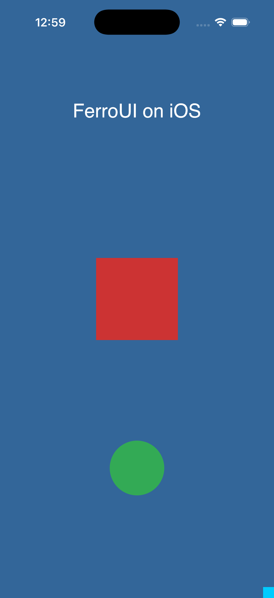
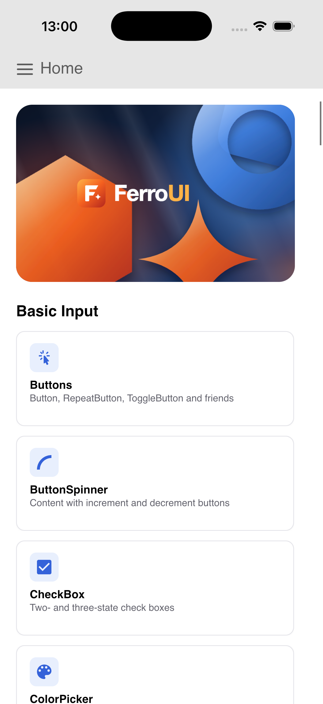
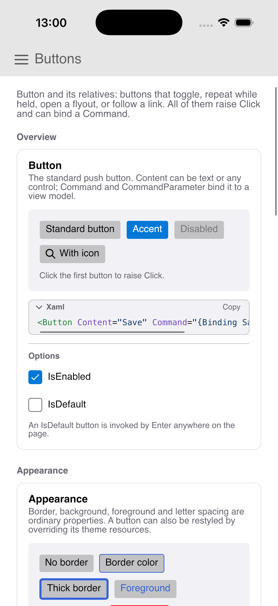
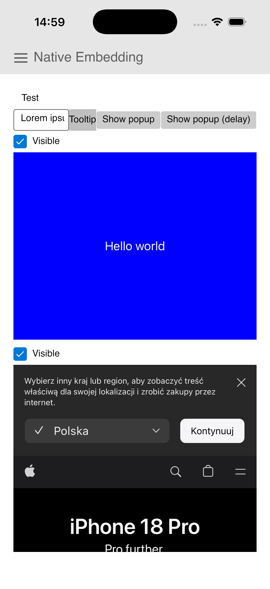

# The iOS platform

The design of the iOS backend of FerroUI, the decisions it rests on, the file table of the port and its stages. Upstream: `src/iOS/Avalonia.iOS` (40 files, 57 types, 331 members, 5380 lines) at the tracked commit (`TRACKING.md`), with the sample host `samples/ControlCatalog.iOS`.

Marks, as in the other platform documents: **[V]** verified from sources (the upstream files, the sources of a crate in the cargo registry, `cargo info`, the system headers through the bindings), **[M]** measured here (a build, a test run or a tool run on the development machine: a Mac with Xcode 26.4.1, the iOS 26.4 SDK and simulator runtime, Rust 1.89 or later with the targets `aarch64-apple-ios` and `aarch64-apple-ios-sim`), **[S]** shown by a run in the simulator (section 12 says which runs happened), **[R]** recalled and not verified here.

## 1. The crate

| Crate | Directory | Upstream | Enabled by |
|---|---|---|---|
| `ferroui-ios` | `src/iOS/FerroUI.iOS` | `Avalonia.iOS` | `AppBuilder::use_ios()` / `use_ios_with_delegate(..)` (`IosApplicationExtensions`); an application starts with `ferroui_ios::run_application::<App>()` |

It depends on `ferroui-base`, `ferroui-controls`, `ferroui-metal` (the Metal contracts it implements), and on `ferroui-skia` and `ferroui-harfbuzz`, because the platform selects its renderer and its shaper as upstream's `UseiOS` does (`.UseHarfBuzz().UseSkia()`; the upstream project references both).

What is compiled where:

| Part | Compiled for | Why |
|---|---|---|
| Everything that calls UIKit, Core Animation or Metal | `target_os = "ios"` | The frameworks exist there only. |
| The dispatcher and its declarations (`dispatcher_impl.rs`, `interop.rs`) | `target_vendor = "apple"` | They need Core Foundation and libdispatch and nothing of UIKit, so the dispatcher runs, and is tested, on the run loop of a macOS process. |
| The logic of every file that is not a call into the system: the options and the choice of the rendering mode, the translation of a touch (device, event type, pressure, modifiers, timestamp), the safe area of a view, the view controller's state, the insets manager, the orientation and bounds of a screen, the stubs, the activation events | every target | It is what `cargo test -p ferroui-ios` runs on the development machine and in CI. |

A file with both kinds has its logic at the top and its UIKit part in a module `uikit` behind the configuration. The view controller is the example: the Objective-C class (`DefaultFerroViewController`) only forwards to `ViewControllerState`, which is what the view and the insets manager hold (as `Rc<dyn IFerroViewController>`) and what the tests drive.

The example (`examples/ios_view.rs`) needs a theme, an optional dependency behind the feature `example`, as in the X11 crate.

Minimum system: iOS 14.0. Upstream supports earlier systems with branches (`OperatingSystem.IsIOSVersionAtLeast(13)`, `(13, 4)`, `(14)`): a window created by the application delegate where there are no scenes, no modifier keys and button masks on touch events, no preferred tint colour. The port takes the later branch everywhere and does not have the earlier ones (DEVIATIONS.md); the tint colour is what sets 14.0, because the constant of UIKit it is read through is linked by name. The one check of a version that remains is for the feedback generator of a view (iOS 17.5, `available!`). The Rust targets set their own minimum (the simulator executable built here states 14.0 **[M]**, which is also the minimum of the published Skia binary for the simulator on Apple silicon **[V]**).

tvOS and Mac Catalyst, which the upstream project also targets, are not targets of the port: their branches (`#if TVOS`, `#if MACCATALYST`, the remote's swipe gestures) are left out and listed with the files.

## 2. Bindings: the `objc2` family, no native library

The macOS backend talks to a native Objective-C++ library (`native/FerroUI.Native`) through COM-style interfaces, because that is what upstream does there. Upstream's iOS backend has no native library: it calls UIKit from managed code through the bindings of the .NET iOS workload, and declares its own Objective-C classes with attributes (`[Export]`, `[Register]`). The port does the same in Rust with the **`objc2`** crates:

| Crate | Version | Licence | In the lock file before | Used for |
|---|---|---|---|---|
| `objc2` | 0.6.5 | MIT | yes (`wgpu`, the Vello backend) | messages, `define_class!` for the classes the platform registers |
| `block2` | 0.6.2 | MIT | yes | blocks of notification observers |
| `objc2-foundation` | 0.3.2 | MIT | yes | sets, strings, notifications, run loops |
| `objc2-core-foundation` | 0.3.2 | Zlib OR Apache-2.0 OR MIT | yes | `CGRect`, `CGSize`, `CGPoint` |
| `objc2-quartz-core` | 0.3.2 | Zlib OR Apache-2.0 OR MIT | yes | `CAMetalLayer`, `CADisplayLink` |
| `objc2-metal` | 0.3.2 | Zlib OR Apache-2.0 OR MIT | yes | device, command queue, drawable, textures |
| `objc2-ui-kit` | 0.3.2 | Zlib OR Apache-2.0 OR MIT | **no: the one new package** | `UIView`, `UIViewController`, `UIWindow`, scenes, touches, screens; since stage 2 presses and keys, gestures, traits, text input, the pasteboard, the pickers, feedback; since stage 3 the accessibility element, its constants and its notifications (three more features of the crate, no new package) |

Versions and licences from `cargo info` **[V]**; all are pinned exactly in the manifest of the crate, each without its default features and with the list of framework headers the backend uses (the default is every header of a framework). The lock file gained one package **[M]**.

Why not a native shim (an Objective-C library compiled by `cc`, as on macOS):

| | `objc2` | Native shim |
|---|---|---|
| Follows upstream file by file | Yes: one Rust file per upstream file, the class in it declared where upstream declares it. | No: every class would be split into an Objective-C half and a Rust half with an interface between them that upstream does not have. |
| Build | Cargo only; cross-compiles from a Mac with the Rust target installed **[M]**. | Needs clang for the iOS SDK in the build script of the crate, per target, and an interface definition to keep in step. |
| Safety | The bindings carry what the headers say: main-thread-only classes need a `MainThreadMarker`, protocols state `Send + Sync` (`MTLDevice`, `MTLCommandQueue` **[V]**), nullability is `Option`. Most calls the backend makes are safe functions; `unsafe` remains where a header cannot state a contract (a selector, a block's thread, a class object). | Everything behind the interface is unchecked C. |
| Cost | A dependency with generated bindings for every header enabled. | None in dependencies. |

The `unsafe` of the crate, all of it around Objective-C, Core Foundation or Metal calls, each block with its argument: `define_class!` declarations (thirteen classes after stage 3) and the `msg_send![super(..)]` calls of their overrides; the messages to the class `UTType`, which is found by name; the pointer of a foreign `UIView` handle; the security scopes of URLs; the notification observers; the display link; the scene configuration's delegate class; the `Send + Sync` of the layer handle and of the dispatcher's signal; the `extern` calls of `interop.rs`; the blit and the read-back of a frame capture.

Classes registered with the Objective-C runtime (names are process-wide, and none has the upstream name): `FerroAppDelegate`, `FerroSceneDelegate`, `FerroView`, `DefaultFerroViewController`, `FerroDisplayLinkTarget`; since stage 2 `FerroTextInputResponder`, `FerroTextPosition`, `FerroEmptyTextPosition`, `FerroTextRange`, `FerroPickerDelegate`, `FerroImageOpenPickerDelegate`, `FerroPresentationControllerDelegate`; since stage 3 `FerroAutomationPeerElement`; and `FerroEmbedSampleButton` in the catalog's host.

## 3. Skia and HarfBuzz for iOS

- **Skia binaries are published for both targets with the feature set of macOS.** The Skia backend asks for `graphite` and `metal` on every Apple target (`cfg(target_vendor = "apple")` in its manifest), which with the default features of the bindings gives the key `graphite-jpegd-jpege-metal-pdf`. `skia-bindings` 0.153.3 builds the name of its binary from its commit, the target and the features (`build_support/binary_cache/binaries.rs`) **[V]**. Probed with a one-byte range request, as the Windows job of CI does: for `aarch64-apple-ios-sim`, `aarch64-apple-ios` and `x86_64-apple-ios` the release has `graphite-jpegd-jpege-metal-pdf`, `ganesh-jpegd-jpege-metal-pdf`, `ganesh-gl-jpegd-jpege-pdf` and `jpegd-jpege-pdf` **[M]**. The build scripts for both targets printed `DOWNLOAD AND INSTALL SUCCEEDED` for the Graphite key: no source build happened **[M]**.
- So the rendering path is the one of macOS: **Graphite on Metal**, with the Metal GPU of the Skia backend (`gpu/metal`, compiled for `target_vendor = "apple"` already). Ganesh on Metal is not needed, and Ganesh on OpenGL ES (for EAGL, stage 4) has a binary but cannot be in one build with Graphite (`browser-platform.md`, section 3).
- **One change in the Skia backend**, in its build script and for iOS only: Skia's Metal code uses `@available`, which needs the clang runtime. For the simulator that is `libclang_rt.iossim.a` (the library of the devices has no slice for it), and for both iOS libraries the directive is `static:-bundle`: the libraries are universal archives, which the compiler unpacks into a Rust library for macOS targets only (`Unsupported archive identifier` otherwise **[M]**); left to the final link, the system linker reads them. Nothing changes for macOS.
- **HarfBuzz** (`harfbuzz-sys` 0.8 with `bundled`) compiles for both targets with the `cc` crate and the Xcode toolchain, with nothing configured **[M]**.
- Fonts: Skia's font manager on Apple systems is Core Text, which iOS has; the text of the example is the first check of it **[S]**.

## 4. The application model

Upstream: the sample's `Main` calls `UIApplication.Main(args, null, typeof(AppDelegate))`; `AppDelegate` derives from the generic `AvaloniaAppDelegate<TApp>` and may override `CreateAppBuilder` and `CustomizeAppBuilder`; the delegate builds the application in `application:didFinishLaunchingWithOptions:` with a `SingleViewLifetime`, names `AvaloniaSceneDelegate` as the delegate of each scene, and the scene delegate creates the window, the view and the view controller when a scene connects.

The port:

- **The Rust executable owns `main` and calls `UIApplicationMain`.** `ferroui_ios::run_application::<App>()` (or `run_application_with(delegate)`) is the whole `main` of an application; it registers the delegate class and calls `UIApplication::main` with its name. An application is a Rust binary, not a static library linked into an Xcode project: nothing of the application is written in another language, and the bundle is made by a script (section 5). A static library for an existing Xcode application remains possible (`use_ios()` without a delegate and `FerroView::new` for embedding), as upstream's view "can be embedded into iOS visual tree".
- **The delegate class is one class, not a generic one.** A class of the Objective-C runtime can be neither generic nor derived from in Rust, and UIKit creates the delegate itself from the name of its class. `FerroAppDelegate` is that class; what an application would override is the trait `FerroApplicationDelegate` (`create_app_builder`, `customize_app_builder`), kept by `run_application_with` where the delegate object finds it. `run_application::<App>()` is the default: `AppBuilder::configure::<App>().use_ios_with_delegate(..)`.
- **Scenes.** The scene delegate (`FerroSceneDelegate`) follows upstream: only an application scene without a named configuration gets a window; the window gets a `FerroView` under a `DefaultFerroViewController`, and the lifetime gets the view. The property list of the bundle states `UIApplicationSceneManifest` without configurations, so that UIKit asks the application delegate for the configuration of a scene (section 5).
- **The lifetime** (`SingleViewLifetime`) is upstream's: the main view of the application is the content of the view; setting a new view disposes the old one. The controls crate has the contracts (`ISingleViewApplicationLifetime`, `ISingleTopLevelApplicationLifetime`), which the browser backend uses the same way.
- **Activations.** The delegate observes the background and foreground notifications of the application and raises them through `IFerroAppDelegate`, which the activatable lifetime of the platform turns into the events of the framework. URLs and user activities (the internal delegate interface) are stage 2, with the storage items they carry.

## 5. Packaging without an Xcode project

`scripts/ios/bundle.sh` **[M]**:

1. `cargo build --target aarch64-apple-ios-sim -p <package> --example <name>` (or `--bin`; the build directory is `CARGO_TARGET_DIR`).
2. A directory `<name>.app` with the executable, `Info.plist` and `PkgInfo` (`APPL????`). An iOS bundle is flat: no `Contents` directory.
3. `Info.plist`, written by the script and converted to the binary form with `plutil`: the bundle identifier (`org.ferroui.<name>`), `CFBundleExecutable`, `CFBundleSupportedPlatforms` (`iPhoneSimulator` or `iPhoneOS`), `MinimumOSVersion` read from the executable (`vtool -show-build`), the SDK and Xcode keys (`DTPlatformName`, `DTSDKName`, ...), `UIDeviceFamily` 1 and 2, the orientations, `UIRequiredDeviceCapabilities`, and two keys that matter to the platform: `UIApplicationSceneManifest` (scenes, above) and `UILaunchScreen` as an empty dictionary, which stands for a launch storyboard (without either the system runs an application letterboxed at the size of an old device **[R]**; the smoke run compares the size of the view with the screen, section 12).
4. `codesign --force --sign -` for the simulator: an ad hoc signature is all the simulator asks for. The result verifies (`valid on disk`, `satisfies its Designated Requirement`) **[M]**.

A bundle for a device is assembled the same way but left unsigned: installing on a device needs a development certificate, a provisioning profile and entitlements, which is the owner's decision and a later stage.

No asset catalog, no storyboard, no entitlements: the example needs none.

## 6. Threads

| Thread | What runs on it |
|---|---|
| Main | UIKit, the dispatcher, the property system, layout, input: everything of the UI thread of the framework. |
| `DisplayLinkTimer` | The display link's run loop. The render timer ticks here and "runs in the background", so the compositor of the platform is in the render-thread mode (`render-thread.md`): the server compositor draws on this thread. |

**The dispatcher** (`DispatcherImpl`, on `IDispatcherImplWithExplicitBackgroundProcessing`) is upstream's: a signal is a function queued on the main dispatch queue plus a wake-up of the main run loop, coalesced by an atomic flag; the timer is one run loop timer created in the distant future and moved (`CFRunLoopTimerSetNextFireDate`); an observer of the run loop (before sources, before waiting, after waiting) raises the signal and, before the loop waits, gives background processing its turn. The declarations (`interop.rs`) are upstream's platform invokes as `extern "C"`. The dispatcher is an object of the main thread kept in a thread-local, where the callbacks find it; what another thread holds is the signal handle (`IDispatcherSignal`: the flag and the two process-lifetime pointers). `tests/dispatcher_main_loop.rs` runs it on the main run loop of a macOS process: ten checks (signals from two threads and their coalescing, the timer at its due time, a cancelled timer, background processing once per request) **[M]**.

**The render timer** (`DisplayLinkTimer`): a `CADisplayLink` on a thread of its own, added to that thread's run loop in the common modes, ticking with the time since the timer was created. Two differences from upstream, both so that an object of UIKit is not shared between threads without a statement that it may be: the link is created on the timer thread (upstream creates it on the registering thread and adds it on the timer thread), and in the background its ticks are dropped by an atomic flag instead of the link being paused from the main thread. Each tick runs in an autorelease pool, which the run loop of a secondary thread does not provide.

## 7. Rendering

Upstream offers Metal and OpenGL ES (EAGL), default order Metal first. The view's layer class follows the graphics that were chosen.

**Metal (built).** Upstream has no software mode on iOS, and none is added: the contract would allow one (a framebuffer blitted to a `CGImage` or a Metal texture), but with Skia's Graphite binaries published for both targets there is nothing it would be needed for, and it would be code upstream does not have.

| Object | Upstream | Port |
|---|---|---|
| Graphics | `MetalPlatformGraphics`: the system default device | The same; `Send + Sync` because `MTLDevice` is. |
| Device | `MetalDevice`: device, command queue, a lock | The same, an object of the thread that creates it (the render thread). It announces itself as `IMetalDevice` through its optional features, which is how the render backends of the port find the Metal contract (as on macOS). |
| Surface | `MetalPlatformSurface`: the layer and the view | The layer (behind a handle that states which four calls the render thread makes on it: `setDevice:`, `setDrawableSize:`, `setFramebufferOnly:`, `nextDrawable`) and a state shared with the view. |
| Render target | `MetalRenderTarget`: `PendingLayout` set by the view; sets the drawable size when the layout changed; `nextDrawable` | The same; the pending layout is read from the shared state under a lock instead of being a property the UI thread sets on an object of the render thread. |
| Session | `MetalDrawingSession`: the drawable's texture; disposing presents (`presentDrawable`, `commit` on a new command buffer) | The same. |

Layer setup, as upstream: `contentsScale` from the main screen, the Metal layer not opaque. Size and scale: `layoutSubviews` reports the size in points to the top-level (`resized`), the scale when it changed (`scaling_changed`), and publishes the size in pixels (`bounds * contentScaleFactor`, truncated) with the scale; the next frame sets `drawableSize` from it.

**Additions for an application that tests itself** (DEVIATIONS.md): `FerroView::frames_presented()` and `FerroView::capture_next_frame(callback)`. A capture makes the layer not "framebuffer only" for the frame, copies the drawable's texture to a shared-storage texture with a blit on the queue the frame was drawn on, waits for it, and hands the bytes to the callback before the frame is presented.

**OpenGL ES over EAGL (stage 4, not built).** `Eagl/EaglDisplay.cs`, `EaglLayerSurface.cs`, `LayerFbo.cs` over the OpenGL contracts of `ferroui-opengl`. It needs Skia with Ganesh on GL (a binary exists, section 3) in place of Graphite, so it is a different build of the Skia backend, not a run-time choice next to Metal as upstream has it; and Apple deprecated OpenGL ES in iOS 12. Until built, the mode counts as one that could not be created: the default list (Metal, OpenGL) gives Metal, and a list with OpenGL alone fails with upstream's message.

## 8. The view and its top-level

`FerroView` (`UIView`, layer class `CAMetalLayer`) creates, as upstream's constructor: the top-level implementation, the input handler, an `EmbeddableControlRoot` over the implementation; prepares it, starts rendering, sets up the layer, enables multi-touch.

`TopLevelImpl` (`ITopLevelImpl`): client size = the bounds of the view; render and desktop scaling = `contentScaleFactor`; the compositor of the platform; no popups (in-window popups); no cursor, no transparency; points map to the screen one to one, as upstream; the frame theme variant sets the status bar style of the view controller. Features in stage 1: the insets manager and the screens. The platform handle of the view (`UIViewControlHandle`) is made when asked for, so that the view (which owns its top-level) is not retained by it.

Ownership: the view owns its state; the top-level implementation and the input handler refer to the view weakly. The Rust state lives in the instance variables of the Objective-C object and is released with it.

## 9. Input

Stage 1: **touches**. `touchesBegan/Moved/Ended/Cancelled:withEvent:` go to the input handler, which for each touch: ignores indirect touches (a remote's trackpad); gives the touch an identifier that lasts until it ends or is cancelled (a counter across views, keyed by the touch object); picks the device (touch, pen for a pencil, mouse for an indirect pointer); maps the phase to the raw event (touch begin, update, end, cancel for a finger; left or right button down and up, move, leave for the others, the right button from the event's button mask); position in the view's coordinates; pressure as half the force (0.5 without force sensing); the modifier keys of the event; the timestamp in milliseconds; and the coalesced touches of the event as lazy intermediate points.

The mapping is in functions over plain values, tested on the host (seven tests). What a test cannot do, on the host or in the simulator, is deliver a touch: an application cannot synthesize one for itself without private interfaces (section 12).

Stage 2a adds the rest of the handler:

- **Key presses.** `pressesBegan/Changed/Ended/Cancelled:withEvent:` go to the input handler, and a press nothing handled goes on to the superclass. A press with a key (`UIKey`) the key table has is a keyboard press: the physical key of its HID usage (the table of upstream, 120 rows, each compared at build time with the constant of UIKit it is named after), the modifiers, and the characters unless they are the name of an input constant (`UIKey...`). Any other press is taken by its type (the arrows, select, menu, play/pause, page up and down) as a press of a remote. The key of the event is the QWERTY key of the physical key; a press without one is skipped. Began, changed and stationary are key down, the rest key up. A key down nothing handled that has characters is followed by a text input event.
- **The scroll wheel.** A pan gesture recognizer that takes no touches and both kinds of scroll events. While it changes, a wheel event with the velocity over 3000 at the location the gesture began; when it ends, inertia: the velocity over 800, multiplied by 0.95 at every tick of a display link on the main run loop, a wheel event per tick, until the magnitude is under 0.0001.

Both are plain functions and a small state (`translate_press`, `key_event_type`, `MomentumScrolling`) with the UIKit part around them; 13 tests on the host. What no test can do is deliver a press or a scroll event (section 12). Text input is section 10.

## 10. Text input (stage 2b, built)

Upstream: the view is the `ITextInputMethodImpl`; when a client is set it creates a `TextInputResponder` (a `UIResponder` implementing `UITextInput` and `UIKeyInput`, 683 lines in two files) and makes it first responder, which brings up the keyboard; the responder answers UIKit's questions (text in a range, selection, marked text, caret and selection rectangles, positions and ranges as its own `UITextPosition`/`UITextRange` subclasses) from the `TextInputMethodClient`, and applies insertions, deletions and marked text to it; the keyboard's traits (type, return key, autocorrection, secure entry) come from `TextInputOptions`; `UIKitInputPane` reports the keyboard's frame and animation from the keyboard notifications. In Rust that is four more classes declared with `define_class!` (`FerroTextInputResponder`, `FerroTextPosition`, `FerroEmptyTextPosition`, `FerroTextRange`) and the `UITextInput`, `UIKeyInput` and `UITextInputTraits` protocols of the bindings. The contracts exist in the base crate and are used by the browser and macOS backends.

What was built, as upstream:

- **The view and the first responder.** The top-level's `ITextInputMethodImpl` forwards to the view (a view is not an `Rc`; DEVIATIONS.md). `set_client` with a client creates a responder for it and makes it the first responder; without one, and on `reset`, the view takes the first responder back if a responder of its own had it ("is driving text"). The responder that is the first responder (the view or a text input responder) is kept in a thread-local, as upstream's static property.
- **The responder.** Its next responder is the view, so key presses of a hardware keyboard still reach the view. `insertText:` is a text input event, except a new line: a key press of Enter, then by the return key the focus moves on (Next) or the keyboard is dismissed (Done, Go, Send, Search). `deleteBackward` is a key press of Backspace. `replaceRange:withText:` sets the selection of the client and sends the text. Marked text is the pre-edit text of the client (`set_preedit_text`); `unmarkText` commits it as text input. The document is the surrounding text of the client plus the marked text; positions and ranges are indices in UTF-16 code units, the unit of UIKit and of the client's selection. `caretRectForPosition:` is the cursor rectangle of the client, `firstRectForRange:` the rectangle the text input method was given, `closestPositionToPoint:` a hit test of the text layout of the presenter. While the client reports a change of its surrounding text, the responder tells the input delegate (text and selection will change, did change) and ignores what UIKit sets as the selection in response. Writing direction, selection rectangles and the position in a range are upstream's to-dos, ported as they are.
- **The traits.** Keyboard type from the content type (alpha, digits, PIN, number, e-mail, URL, name, social, search), the return key from the options (or Done for one line), secure entry for passwords, PINs and sensitive content, autocorrection and spell checking unless suggestions are off; the input mode from the locale hints.
- **The input pane.** `UIKitInputPane`, one per application: the keyboard's will-show and will-hide notifications set the state and the occluded rectangle (the end frame, in the coordinates of the screen) and raise the change with the start frame, the duration and an easing. Upstream reads the animation curve of the notification as animation options and tests the curve options as flags, of which "ease in out" has no bits: every curve gives the sine ease in out (kept, with a test that says so).

The arithmetic (ranges, positions, the text of a range with and without marked text, the traits from the options) is plain functions with 13 tests on the host; `combined_span3.rs` has 3, the input pane 3.

## 10a. Clipboard, storage and activations (stage 2c, built)

- **Clipboard** (`clipboard/`, four files as upstream): `ClipboardImpl` over `UIPasteboard.general`, wrapped by the `Clipboard` of the base crate as the feature of the top-level. Reading gives a data transfer that is valid while the change count of the pasteboard is the one it was made at; an item of the pasteboard (a dictionary from uniform type identifiers to values) is an item of the transfer. Formats: plain text, a file URL (a storage item), images (PNG and JPEG as they are, TIFF and generic images through `UIImage`, always handed over as a bitmap decoded from PNG), and any other type as a string when the system knows the type as text, else as bytes. Writing sets the items of the pasteboard: text and strings as `NSString`, bytes as `NSData`, a bitmap as a `UIImage` made of its PNG, a file as the string of its URI; formats that are in-process only are passed over. The clipboard owns its content while the change count is the one after its last write.
- **Storage** (`storage/`, two files): `IosStorageProvider` shows the document picker of the system for opening files (the uniform types of the filter: per file type its extensions, else its identifiers, else its MIME types; without a filter content, items and data), for opening folders, and for saving (a temporary empty file with the suggested name is "exported", and the URL the picker returns is the file); a single picture from the Pictures folder is asked for with the image picker. The choice arrives through three delegate classes (`FerroPickerDelegate`, `FerroImageOpenPickerDelegate`, `FerroPresentationControllerDelegate`, the last for a picker that is swiped away) into a completion the returned future waits for. Items are URLs: every operation runs between `startAccessingSecurityScopedResource` and its stop on the URL the user opened (or an ancestor that was: an item found in an opened folder carries the folder's URL), streams end the scope when they are dropped, bookmarks are the bookmark data of the URL encoded with the platform key `ios` (the base 64 form of earlier versions is still read), folders are listed inside a coordinated read.
- **Activations**: `application:openURL:options:` and `application:continueUserActivity:restorationHandler:` of the application delegate, and for scenes `scene:openURLContexts:`, `scene:continueUserActivity:` and the URLs and activities a scene is connected with. A file URL is a file activation with its storage item, any other absolute URL a protocol activation, an activity of browsing the web a protocol activation with its page.

Host tests: the formats and their types (3), UTF-16 conversion (1), paths and dates of items (2), the filter and the well-known folders (4), the activations (3).

## 10b. The native control host (stage 2d, built)

`NativeControlHostImpl`, a feature of the top-level: a native control is a `UIView` that becomes a subview of the view of the top-level. An attachment adds the view when it is attached and removes it when it is detached or disposed; `show_in_bounds` sets the frame (at least one point wide and high) and shows the view, `hide_with_size` hides it with a frame of that size at the origin. The default child is an empty `UIView`. A handle is compatible when its descriptor is `UIView`; `UIViewControlHandle` is the handle an application makes of its view. Stage 2 adds no dependency: the lock file is as stage 1 left it apart from the catalog host naming the bindings it now uses directly.

## 10c. Accessibility (stage 3, built)

Upstream: the view is an accessibility container (`IUIAccessibilityContainer`: container type, element count, element at an index, index of an element) that forwards to an `AutomationPeerWrapper` of the automation peer of its top-level. A wrapper is a `UIAccessibilityElement` and a container itself: it has a wrapper per child of its peer that is on the screen, made when its elements are counted, and it sets the properties of the element from the peer. UIKit (VoiceOver, Switch Control, the accessibility inspector, UI tests) walks the containers and reads the elements.

The port, `automation_peer_wrapper.rs`, in the two layers of every file of this crate:

- **`AutomationPeerWrapper`** is plain Rust and holds everything upstream's class does: the peer, the parent, the list and the map of the children, and the values the element answers with. Its members are upstream's: `update_children` (the properties and traits of the wrapper, then a wrapper for every child of the peer that is not off the screen, the same wrapper for the same peer, the wrappers of children that left disposed), the seven setters keyed by automation property (identifier, name, help text, bounding rectangle, read-only state, value, selection) with one call per setter, `update_all_properties`, `update_traits`, activation, increment and decrement, scroll, the focus questions, `dispose`. It follows `ChildrenChanged` and `PropertyChanged` of its peer. What it needs of the view is a trait (`IWrapperView`: a point of the root element on the screen, the notification of a scrolled page), which the tests answer.
- **`FerroAutomationPeerElement`** (the module `uikit`) is the class of the Objective-C runtime, a `UIAccessibilityElement`. It holds its wrapper weakly and answers every member of the accessibility protocols from it: `isAccessibilityElement`, `accessibilityIdentifier`, `accessibilityLabel`, `accessibilityHint`, `accessibilityValue`, `accessibilityFrame`, `accessibilityTraits`, `accessibilityRespondsToUserInteraction`, `accessibilityContainerType`, the three container members, `accessibilityActivate`, `accessibilityElementIsFocused`, `accessibilityElementDidBecomeFocused`, `accessibilityIncrement`, `accessibilityDecrement`, `accessibilityScroll:` (the last five call the superclass first, as upstream). The object of a wrapper is made when UIKit first asks for it, with the object of the parent wrapper (the view for the root) as its accessibility container, and is the same object for as long as the wrapper lives.
- **The view** (`ferro_view.rs`, upstream's `AvaloniaView.Automation.cs`) creates the wrapper of the peer of its top-level in its constructor and answers the four container members from it.

The mapping, as upstream:

| What | From |
|---|---|
| Label, hint, identifier | The name, the help text and the automation id of the peer. |
| Value | A range value with at most two decimals (`0.##`), else the value of a value provider. |
| Frame | The bounding rectangle of the peer, its two corners put on the screen through the root element of the top-level (which on iOS maps a point of the view to the same point, section 8) and truncated. |
| Traits | Button, header, link or image by the control type; "not enabled"; "selected" when the peer, or a wrapper above it, is a selected selection item. "Adjustable" is set with the properties when the peer has a writable range: see below. |
| Responds to user interaction | Enabled, and a writable value or range, a selection item (its own or of a wrapper above), a toggle, an invoke or a scroll provider. |
| Is an element | On the screen and a control element. A wrapper whose control type is one of the 24 container types is a semantic group and no element, unless it is a selection item with a name (a list item, a tab item): then it is the element. |
| Activation | Select (a selection item), else toggle, else invoke, else select the selection item of the parent. |
| Increment, decrement | The value of a range plus or minus its small change. |
| Scroll | A page: up and down scroll vertically, left and right horizontally; the "page scrolled" notification is posted. Next and previous are not scrolled. |
| Focus | An element is focused when its peer has the keyboard focus; an element that became focused is brought into view. |

**Kept from upstream, found by the tests: a slider is not adjustable.** `UpdateChildren` calls `UpdateAllProperties` and then `UpdateTraits` on every wrapper. The first sets the adjustable trait (in the read-only setter); the second assigns the traits anew from the control type and the enabled state, without it. The trait comes back only when a read-only property of the peer changes, which the range peers never raise. So the element of a slider has its value and can be incremented and decremented by the two messages, but VoiceOver is not told that it is adjustable and does not offer the gesture. The port has the same order and the same result (a host test and the smoke check state the trait as it is); changing it is one line and the owner's decision.

Notifications: upstream posts one, "page scrolled", after a scroll. Nothing is posted when a peer changes (no "layout changed" or "screen changed"): the wrapper updates what the element answers with, and assistive technology reads it at its next question. The port posts what upstream posts.

Host tests (11): the traits by control type and enabled state, the container types, the frame between two corners, the range value format (with the ties the format rounds away from zero), the scroll amounts, the children of a panel in their order with the index of each and a child that leaves or goes off the screen, a button (element, trait, activation raises the click, refused when disabled), a check box that toggles and a text box with its value, hint and identifier (and a value change that reaches the element without a question of the container), a slider (value, increment, decrement, the traits as above), the frame through the view, a disposed wrapper.

## 11. Insets and the safe area

`DefaultFerroViewController.viewDidLayoutSubviews` computes the safe area padding from the frame of the view and the frame of its safe area layout guide and raises a change. `InsetsManager` (on `InsetsManagerBase`): the padding is the controller's while the application draws edge to edge (the default) and zero otherwise; the system bar is the status bar of the controller. When edge to edge is turned off, the top-level gets the safe area as its padding at style priority, because iOS adds no margins by itself (upstream's comment and behaviour).

## 12. Verification

1. **Compilation** for `aarch64-apple-ios-sim` and `aarch64-apple-ios`: the crate and the example build and link **[M]**.
2. **Tests on the host** (`cargo test -p ferroui-ios`): 102 unit tests of the logic after stage 3 (section 1; 36 after stage 1) and the dispatcher on a real run loop (ten checks) **[M]**. Upstream has no tests of this project to port.
3. **The smoke mode in the simulator**: `scripts/ios/sim-smoke.sh "<device>"` builds, bundles, boots the device if needed, installs, launches `ios_view --smoke` with the console attached, waits (180 seconds at most), takes a screenshot of the simulator, prints the checks and a result, uninstalls and shuts the device down (`--keep` leaves it). The application writes its lines to the standard output and to `Documents/ios_view_smoke.txt` in its data container, which the script copies out.

What the smoke mode proves, each a line `[ ok ]` or `[FAIL]`:

| Check | What it compares |
|---|---|
| platform | Metal graphics were created, the render timer exists. |
| view | The scene connected, the lifetime has a view, the view is in a window. Proves `UIApplicationMain`, the delegate class, the scene configuration, the scene delegate and the bundle's property list. |
| size | The client size of the top-level = the bounds of the view = the bounds of the window. |
| scale | The render scaling of the top-level = the view's content scale = the scale of the window's screen. |
| screen | The screens of the framework: a primary screen with the native scale and the native pixel size of the `UIScreen`. |
| safe area | The padding of the insets manager = the layout guide of the view = `safeAreaInsets` of the view. |
| frames | At least three frames were presented on the Metal layer (the display link thread ticks, the compositor renders on it, drawables are presented). |
| frame size | A frame read back from the Metal texture has the size of the view in pixels. |
| pixels | In that frame: the fill, the square in the middle and the circle above the bottom edge have their colours where layout puts them. Proves Skia's Graphite on Metal drew, at the right scale and the right way up. |
| text | The band of the text line has pixels that are not the fill: a system font was found, shaped by HarfBuzz and drawn. |

The checks of stage 2 (the module `stage2` of the example), in the same report:

| Check | Stage | What it compares |
|---|---|---|
| settings | 2a | The theme variant of the platform settings = the user interface style of the traits of the view; the preferred language = the first of `NSLocale.preferredLanguages`. The contrast and the accent colour are printed. |
| trait change | 2a | The example gives its window the other user interface style (`overrideUserInterfaceStyle`): the view's `traitCollectionDidChange:` has to reach the settings, which have to raise `color_values_changed` with the other variant and answer with it afterwards. |
| scroll gesture | 2a | The view has one pan gesture recognizer, for no touches and both kinds of scroll events. |
| launcher | 2a | The top-level has a launcher; a URI of a scheme no application has is answered with `false` at once. |
| feedback | 2a | The top-level has its feedback: the sound of a click is performed, holding has no sound, the tap of holding is performed (the haptic engine of a simulator does nothing with it). |
| text focus | 2b | A text box of the example takes the focus (its content type was set to e-mail first). |
| text responder | 2b | At the next attempt the view "is driving text": a text input responder of the view exists and UIKit says it is the first responder. Proves the input method manager, the feature of the top-level, `set_client` and `becomeFirstResponder`. |
| keyboard traits | 2b | Asked as UIKit asks: the keyboard type is the e-mail one, the return key Done (one line), the entry not secure. |
| insert text | 2b | `insertText:` "abc": the text box has "abc"; the document is 3 long (`offsetFromPosition:toPosition:` of its ends), `textInRange:` of it is "abc", the selected range is empty at 3. |
| positions | 2b | `positionFromPosition:offset:`: the text from offset 1 to the end is "bc"; there is no position after the end. |
| marked text | 2b | `setMarkedText:selectedRange:` "xy": the marked text is held, `markedTextRange` is 3 to 5; after `unmarkText` the text box has "abcxy" and there is no marked range. |
| delete and replace | 2b | `deleteBackward`: "abcx"; `replaceRange:withText:` of the first character with "Z": "Zbcx". |
| input pane | 2b | The example posts a keyboard will-show notification with two frames, a duration and a curve, then a will-hide one: the pane is open over the end frame, then closed, with two events that carry the frames and 250 ms. The detail also prints what the keyboard of the system itself had reported while the text box was focused, which depends on the simulator (no software keyboard appears while a hardware keyboard is connected to it). |
| text end | 2b | The focus is cleared: the view drives no text and is the first responder again. |
| clipboard | 2c | A text is set through the clipboard of the top-level: `UIPasteboard.general.string` is that text, and it is read back through the clipboard; after clearing there is no text. |
| storage | 2c | The storage provider of the top-level gives the Documents folder; a file is created in it, written through its write stream and read back through its read stream; its properties have the size and a modification date; the folder lists it; its bookmark is saved and resolves to the file again; it is found by its path, and its path is not a folder; a folder is created, the file moved into it (it is there and not where it was, and its parent is the folder), and the folder deleted. |
| native control | 2d | The native control host of the top-level attaches a view of UIKit: the parent handle it offers is the view of the top-level, the view becomes its subview, in the window of the view, the frontmost of its subviews, at its bounds in the coordinates of the window with full opacity; shown in bounds it has that frame (a height of 0 becomes 1) and is visible; hidden with a size it is hidden with that size at the origin; disposed, it has no superview; the default child is a handle the host accepts. |
| activations | 2c | The example calls `application:openURL:options:` of the application delegate, as UIKit does, with a URL of a scheme and with a file URL: the activatable lifetime reports an activation of the kind "open URI" with the URI and one of the kind "file" with a storage item. |

The checks of stage 3 (the module `stage3` of the example), after the checks of text input:

| Check | What it compares |
|---|---|
| accessibility traits | The values of the traits the port sets against the constants of UIKit (`UIAccessibilityTraitButton` and six more). |
| accessibility container | The view answers `accessibilityContainerType` with "semantic group", is no element itself and has elements; every object reached by walking `accessibilityElementCount` and `accessibilityElementAtIndex:` from the view is a `FerroAutomationPeerElement`. |
| accessibility button, text box, check box, slider | The element with the label of each control ("Press", "Name", "Agree", "Volume") is an accessibility element with the traits expected (button for the button), the value expected (the text of the text box, "4" for the slider), the frame of the control in the view, and `indexOfAccessibilityElement:` of its container answers with the index it was found at. |
| accessibility activate | `accessibilityActivate` of the elements: true for the button and the check box, false for the text box, which has no default action. |
| accessibility click, toggle, increment | At the next attempt: the button raised one click, the check box is checked, the slider went from 4 to 5 after `accessibilityIncrement` and its element says "5". |

What it cannot prove: **VoiceOver itself**. The checks send the messages of the accessibility protocols to the objects, as assistive technology does, in the process of the application; that VoiceOver finds the view, reads the elements in a sensible order, speaks the labels, moves its cursor to the frames and performs the gestures is not shown by any run, and neither is Switch Control, Voice Control or the accessibility inspector of Xcode. Also: touch input, key presses and scroll events (no synthetic input from inside an application; `simctl` has no touch or key command), so that the handlers are reached at all is shown only by hand; the pickers of the storage provider (they are shown for a person to choose in), a security scope (the files of the example are its own), a URL or a user activity the system delivers to a scene (the bundle of the example registers no URL scheme, so `simctl openurl` has nothing to open), images and files on the clipboard; that the keyboard of the system and its input methods (autocorrection, dictation, a marked-text input method such as Pinyin) drive the responder the way the example does, and what the keyboard looks like for the traits; that a launched URI opens (it would leave the application); that the sound is heard; rotation and a change of the safe area; the background and foreground transitions; the launch screen. The screenshot the script takes shows what the simulator composited, for a person to look at; it is not compared.

Runs in the simulator (2026-10-10, "iPhone 17 Pro", iOS 26.4, a debug build; the orchestrator of the port runs the script, because the simulator may only run while no virtual machine does) **[S]**:

| Run | Result |
|---|---|
| 1 | The application started at the first attempt, without a crash: platform, view (402x874 points), size, scale 3, one screen of 1206x2622 pixels at 3, safe area (top 62, bottom 34, equal to the layout guide and to the insets of the view) passed. One frame was presented and no more, and no frame was read back: the example asked for a redraw by invalidating a panel that draws nothing, so nothing changed after the first frame. A fault of the example. |
| 2 | **SMOKE PASSED** at the fourth attempt (two seconds after the start of the checks): all ten checks. The example now changes the colour of a marker at every attempt. The frame read back is 1206x2622, `BGRA8Unorm`; the fill, the square and the circle have exactly the colours that were drawn ((51, 102, 153), (204, 51, 51), (51, 170, 85)); 11249 pixels of the text band are not the fill. |

Seen in the trace of run 2, and open: the first frame took about a second and a half (begun at the first attempt, presented by the fourth; the display link, whose handler was drawing, did not tick meanwhile: 19 ticks before, 38 after). A first frame compiles the pipelines of Graphite, in a debug build, in the simulator; it was not measured further, and a release build on a device is where it should be. After the frames the render loop detaches from the timer (`render loop attached: false`), as it does on every platform when nothing changes.

The screenshots of both runs failed: the simulator service may not write into the build directory on the external volume. The scripts write them to `~/Library/Caches/ferroui-ios-smoke/` since.

| Run | Result |
|---|---|
| 3 | The smoke mode again, **SMOKE PASSED**, with its screenshots (`images/ios_view.png`: the view fills the screen under the status bar and the sensor housing, the text, the square, the circle and the marker where layout puts them). |
| 3, the catalog | `scripts/ios/sim-catalog.sh "iPhone 17 Pro"`: the ControlCatalog (`samples/ControlCatalog.iOS`, the crate `control-catalog-ios`) started at its first attempt with the Fluent theme from compiled markup, found its 75 pages, and showed Home, Buttons, TextBox and ListBox, five seconds each, with a screenshot of each (`images/ios_catalog_home.png`, `images/ios_catalog_buttons.png`): **CATALOG SHOWN**. Read from the pictures: the page host with its navigation bar under the status bar, the embedded images and icons, text in the system font and in the monospaced font of the markup samples, check boxes, buttons, rounded borders, a scroll bar. The activatable lifetime reported the activation of the application (`App activated: Background`). |

| 4 (stage 2a) | **SMOKE PASSED** at the second attempt: the ten checks of stage 1 and settings (Light, no contrast preference, the language "en-PL" as the first preferred language; the accent stayed the default of the framework: the preferred tint of the system is its blue, which has no red, and upstream passes over a tint with a component of zero), scroll gesture, launcher, feedback, trait change (the view became Dark, the settings raised one change and answered Dark). |
| 5 (stage 2b) | **SMOKE PASSED** at the fourth attempt, without a crash at the first time UIKit talked to the responder: text focus, text responder (the first responder), keyboard traits (type 7, return key 9, not secure), insert text, positions, marked text, delete and replace ("abcx", then "Zbcx"), input pane (open over the posted frame, closed, two events), text end. The keyboard of the system itself had reported a pane of height 0 at the bottom of the screen while the text box was focused: the simulator had a hardware keyboard connected, so no software keyboard was shown. |
| 6 (stage 2c, first attempt) | The application ended while its scene connected: the bindings declare `UISceneConnectionOptions.URLContexts` (and `userActivities`) as never null and fail on null, and UIKit returns null for a scene that is connected without any. The scene delegate reads both as optional since. |
| 7 (stage 2c, second attempt) | The checks ran up to the storage check, which failed the same way in a second place: `UIDocument.localizedName` is declared as never null and is null for a document that was not opened. Read as optional since, with upstream's fall-back to the file name. Both faults are of the kind only a run finds: the headers of the system say one thing and the system does another, and upstream's code allows for null in both places. |
| 8 (stages 2c and 2d) | **SMOKE PASSED** at the fourth attempt: clipboard (the text was on the general pasteboard and read back; nothing after clearing), storage (in "Documents": created, written, read (25 bytes), listed, bookmarked (1624 characters), found by bookmark and by path, moved, deleted), activations (an "open URI" activation with the URI and a "file" activation with "activated.txt"), native control. Repeated with the strengthened native control check (in the window of the view, the frontmost subview, at its place in the coordinates of the window): passed. |
| 8, the catalog | The Native Embed page of the catalog, three times. First: the page with its own controls and two empty areas where the native controls belong. Second, with the host printing the UIKit subviews of the view: both were attached, visible and of the right size (`FerroEmbedSampleButton` at (422, 226) 362x278, `WKWebView` at (422, 542) 362x278), one width of the screen (402) to the right of their place. Third, with the main view laid out once more after the page had slid in: (422, ..) before, (20, ..) after, and the picture below: the button of UIKit and the web view with a page of the network. See "Open" below for why. |

| 9 (stage 3) | **SMOKE PASSED** at the fifth attempt, without a crash at the first time the accessibility classes were used: the seven trait values are the constants of UIKit; the view is a container of type 4 with one element; 48 objects are under it, all of the class of the port, of which 8 are accessibility elements ("FerroUI on iOS", "Name", "Press", "Agree", "Volume" and three text presenters without a name); the button at (91, 574) 220x22 with the button trait, the text box at (91, 230) 220x22 with the value "Zbcx" the text checks left in it, the check box at (91, 596) 220x18, the slider at (91, 614) 220x20 with the value "4", each at the frame of its control and at its index in its container; activation true for the button and the check box and false for the text box; one click, the check box checked, the slider at 5 with the element saying "5". |

Found by run 8, and fixed in the controls crate since (below): **a native control of a page that slides in stays where the page was laid out.** `NativeControlHost` (the controls crate) places its control when its bounds or visibility, or those of a visual ancestor, change, with the transform to the root at that moment; a render transform that changes afterwards is not a reason to place it again. The page host of the catalog (`NavigationPage` in a `DrawerPage`, as in upstream's catalog) slides a page in with a render transform, so the native controls of the page are placed one page width off and stay there until the next change of layout (a rotation, a resize, the keyboard, anything that changes bounds). The port's `native_control_host.rs` was compared with upstream's `NativeControlHost.cs` at the tracked commit line by line: the same subscriptions (the property changes of the control and of its ancestors, for `Bounds` and `IsVisible`), the same deferred update, the same transform; upstream has no layout-updated or viewport subscription either. So by reading, this is upstream's behaviour, on every platform with a native control host and a transition; it was not checked by running upstream's catalog on iOS. Nothing was changed in the controls crate. The platform's part is right: the frame it is given is the frame the view gets. The catalog host's smoke run of run 8 laid the main view out once more after a page was selected, so that its pictures showed the page as it is after any change of layout, and printed the native views before and after.

**Fixed in the controls crate (branch `native-control-host-transforms`, not yet run on a simulator).** The cause is the one read above, now reproduced on the Mac without a device (`native_control_host_tests.rs` of the controls crate: the control was shown once, in the first frame of the transition, one page width off): the first layout of the incoming page happens in the render pass whose clock pulse has just applied the first key frame of the slide, the job that places the control runs after that pass, and nothing changes bounds afterwards. `NativeControlHost` now places its control also when a render transform of itself or of an ancestor is set, replaced, removed or changes in place (`DEVIATIONS.md`, "Native control host": an upstream defect, fixed). The host's smoke run no longer lays the main view out again; it prints `Native views of <header> after the transition: ..` half way through the time of a page. The run that proves it: `scripts/ios/sim-catalog.sh "iPhone 17 Pro" --pages "Native Embed,Home"`, whose log must have both native views at x = 20 in that line (they were at 422), and whose picture must show the button and the web view in the page.

   

`scripts/ios/sim-catalog.sh <device> [--pages a,b,c] [--page-ms n] [--keep]` is the script for pictures of the catalog (half way through the time of a page the host prints `Native views of <header> after the transition: ..`): the host has the smoke run of the desktop host (`FERROUI_SMOKE_PAGES=<ms>`, and `FERROUI_SMOKE_PAGE_NAMES=<headers>` to name pages; `FERROUI_SMOKE_EXIT_MS`), prints `Selecting <header>` for each page, and the script takes a screenshot of the simulator a second before the next page.

4. **CI** (the job `ios` of `.github/workflows/ci.yml`, macOS runner): adds the two Rust targets, checks that the Skia features of the target are the Graphite and Metal set, builds the crate and the example for the simulator, checks the crate for the device target, runs the host tests, and bundles the example (`bundle.sh`, with the ad hoc signature verified). It does not run the simulator: a boot of a simulator on a hosted runner takes minutes and fails intermittently **[R]**, and the runner image decides which runtimes exist. The script is written so that a later step can call it (`sim-smoke.sh "<device>"`, exit code 0 on success) once a run has been shown to be reliable; expected cost two to five minutes on top of the build **[R]**.

## 13. File table

One row per upstream file. "built" files are on the branch; "part" means the file exists with the part named; the stage of an open file is the one that builds it.

| Upstream file (`src/iOS/Avalonia.iOS`) | Lines | Rust file (`src/iOS/FerroUI.iOS`) | Stage | State | Notes |
|---|---:|---|---|---|---|
| `ActivatableLifetime.cs` | 13 | `activatable_lifetime.rs` | 1 | built | |
| `AutomationPeerWrapper.cs` | 486 | `automation_peer_wrapper.rs` | 3 | built | the wrapper, and the class `FerroAutomationPeerElement` that answers UIKit from it (section 10c) |
| `AvaloniaAppDelegate.cs` | 142 | `ferro_app_delegate.rs` | 1, 2c | built | the delegate, the builder, scenes, background and foreground, URLs and user activities; the window of the systems before scenes is not ported |
| `AvaloniaSceneDelegate.cs` | 88 | `ferro_scene_delegate.rs` | 1, 2c | built | the window of a scene, the activations a scene is connected with or receives |
| `AvaloniaView.cs` | 444 | `ferro_view.rs` | 1, 2a, 2b, 3 | built | the view, layer, layout, touches, presses, the scroll gesture, trait and tint changes, the top-level with the insets manager, the screens, the launcher, the feedback, the text input method, the input pane, the clipboard, the storage provider, the native control host and the wrapper of the root automation peer; the layer of OpenGL ES is stage 4; the tvOS gestures are not ported |
| `AvaloniaView.Text.cs` | 52 | `ferro_view.rs` | 2b | built | the text input method of the view |
| `AvaloniaView.Automation.cs` | 24 | `ferro_view.rs` | 3 | built | the accessibility container |
| `CombinedSpan3.cs` | 40 | `combined_span3.rs` | 2b | built | a helper of the text input responder |
| `DispatcherImpl.cs` | 133 | `dispatcher_impl.rs` | 1 | built | |
| `DisplayLinkTimer.cs` | 45 | `display_link_timer.rs` | 1 | built | |
| `Extensions.cs` | 23 | `extensions.rs` | 1, 2a | built | |
| `IOSLauncher.cs` | 45 | `ios_launcher.rs` | 2a, 2c | built | |
| `IOSPlatformFeedback.cs` | 56 | `ios_platform_feedback.rs` | 2a | built | sound and haptics |
| `InputHandler.cs` | 570 | `input_handler.rs` | 1, 2a | built | touches, presses with the key table, the scroll wheel with its inertia; the swipe gestures of a remote (tvOS) are not ported |
| `InsetsManager.cs` | 55 | `insets_manager.rs` | 1 | built | |
| `Interop.cs` | 58 | `interop.rs` | 1 | built | `extern` declarations |
| `NativeControlHostImpl.cs` | 154 | `native_control_host_impl.rs` | 1, 2d | built | the host, its attachments, `UIViewControlHandle` |
| `Platform.cs` | 140 | `platform.rs` | 1, 2a | built | |
| `PlatformSettings.cs` | 95 | `platform_settings.rs` | 2a | built | colour scheme, contrast, tint, language |
| `SingleViewLifetime.cs` | 40 | `single_view_lifetime.rs` | 1 | built | |
| `Stubs.cs` | 73 | `stubs.rs` | 1 | built | |
| `TextInputResponder.cs` | 587 | `text_input_responder.rs` | 2b | built | `UITextInput`, `UIKeyInput` |
| `TextInputResponder.Properties.cs` | 96 | `text_input_responder.rs` | 2b | built | the keyboard traits |
| `UIKitInputPane.cs` | 58 | `ui_kit_input_pane.rs` | 2b | built | |
| `ViewController.cs` | 82 | `view_controller.rs` | 1 | built | |
| `iOSScreens.cs` | 75 | `ios_screens.rs` | 1 | built | |
| `Clipboard/ClipboardDataFormatHelper.cs` | 61 | `clipboard/clipboard_data_format_helper.rs` | 2c | built | |
| `Clipboard/ClipboardImpl.cs` | 144 | `clipboard/clipboard_impl.rs` | 2c | built | `UIPasteboard` |
| `Clipboard/PasteboardItemToDataTransferItemWrapper.cs` | 101 | `clipboard/pasteboard_item_to_data_transfer_item_wrapper.rs` | 2c | built | |
| `Clipboard/PasteboardToDataTransferWrapper.cs` | 40 | `clipboard/pasteboard_to_data_transfer_wrapper.rs` | 2c | built | |
| `Eagl/EaglDisplay.cs` | 145 | `eagl/eagl_display.rs` | 4 | open | section 7 |
| `Eagl/EaglLayerSurface.cs` | 104 | `eagl/eagl_layer_surface.rs` | 4 | open | |
| `Eagl/LayerFbo.cs` | 156 | `eagl/layer_fbo.rs` | 4 | open | |
| `Metal/MetalDevice.cs` | 34 | `metal/metal_device.rs` | 1 | built | |
| `Metal/MetalDrawingSession.cs` | 34 | `metal/metal_drawing_session.rs` | 1 | built | with the frame capture |
| `Metal/MetalPlatformGraphics.cs` | 37 | `metal/metal_platform_graphics.rs` | 1 | built | |
| `Metal/MetalPlatformSurface.cs` | 25 | `metal/metal_platform_surface.rs` | 1 | built | with the state shared with the view |
| `Metal/MetalRenderTarget.cs` | 37 | `metal/metal_render_target.rs` | 1 | built | |
| `Properties/AssemblyInfo.cs` | 4 | - | - | n/a | assembly attributes |
| `Storage/IOSStorageItem.cs` | 348 | `storage/ios_storage_item.rs` | 2c | built | security-scoped URLs, bookmarks |
| `Storage/IOSStorageProvider.cs` | 436 | `storage/ios_storage_provider.rs` | 2c | built | the document pickers, the image picker, bookmarks, well-known folders |

Stage 1 had 23 of the 40 files, 17 complete and 6 in part. After stage 2: 36 files. After stage 3: 37 files, none in part; open are the three files of `Eagl/` (stage 4). `samples/ControlCatalog.iOS` is the crate `control-catalog-ios` (built in stage 1b): `main.rs` is `Main.cs` and `AppDelegate.cs` (a `main` that calls `run_application_with`, and the delegate trait for the builder, which registers the native control demo after setup as upstream's does), `embed_sample_ios.rs` is `EmbedSample.iOS.cs` (stage 2d: a button of UIKit that counts its touches, and a web view of WebKit), the property list is written by `bundle.sh`, and the launch screen is the empty `UILaunchScreen` of the bundle.

## 14. Stages

| Stage | Content | What a simulator run proves |
|---|---|---|
| 1 (built) | The crate, the platform and its options, the application delegate, scenes, the single-view lifetime, the view and its top-level, the dispatcher, the display link timer, Metal with the Skia GPU, touches, the safe area and the insets manager, the screens, the example with its smoke mode, the bundle and simulator scripts, the CI job | Section 12 |
| 2a (built) | Keys (`presses*`, the key table), the scroll wheel, platform settings (colour scheme, accent, language) with trait changes, the launcher, feedback | The settings against the traits and the locale; a change of the traits (the example gives its window the other style); the scroll gesture is attached; the launcher refuses an unknown scheme; the feedback. Not: a key press or a scroll event, which an application cannot make for itself (section 12) |
| 2b (built) | Text input: `TextInputResponder`, the keyboard traits, the input pane | A focused text box makes a text input responder the first responder; the example then sends that responder the messages the keyboard sends (insertion, marked text, deletion, replacement, the questions about the document) and compares with the text box; the input pane with a keyboard notification the example posts. Not: typing on the keyboard of the system, which needs a person or UI automation |
| 2c (built) | Clipboard (`UIPasteboard`), the storage provider with the document pickers and storage items, activations by URL and user activity | The clipboard round trip against the general pasteboard; the storage items in the Documents folder (create, write, read, list, properties, bookmark, path, move, delete); the activations when the methods of the application delegate are called with URLs. Not: the pickers, which need a person; a URL the system delivers (the example registers no URL scheme) |
| 1b (built) | The catalog's iOS host (`control-catalog-ios`) and `scripts/ios/sim-catalog.sh` | The catalog starts, selects pages and is photographed (section 12) |
| 2d (built) | The native control host, and the embed sample of the catalog over it | A view of UIKit attached under the view of the top-level, shown in bounds, hidden, removed (the example); the Native Embed page of the catalog with the button and the web view, as a picture |
| 3 (built) | Accessibility (`AutomationPeerWrapper`, the container methods of the view) | The tree read through the container protocol by the example itself: labels, values, traits and frames of four controls, activation and increment (section 12). Not: VoiceOver, or any other assistive technology, reading it |
| 4 | OpenGL ES over EAGL, as a build of its own (section 7); a device build with signing | The smoke mode in the OpenGL mode |
